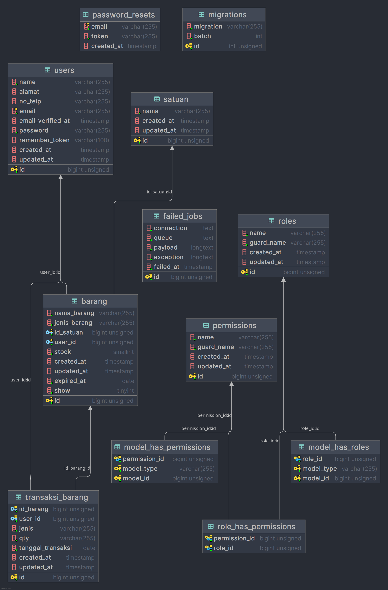
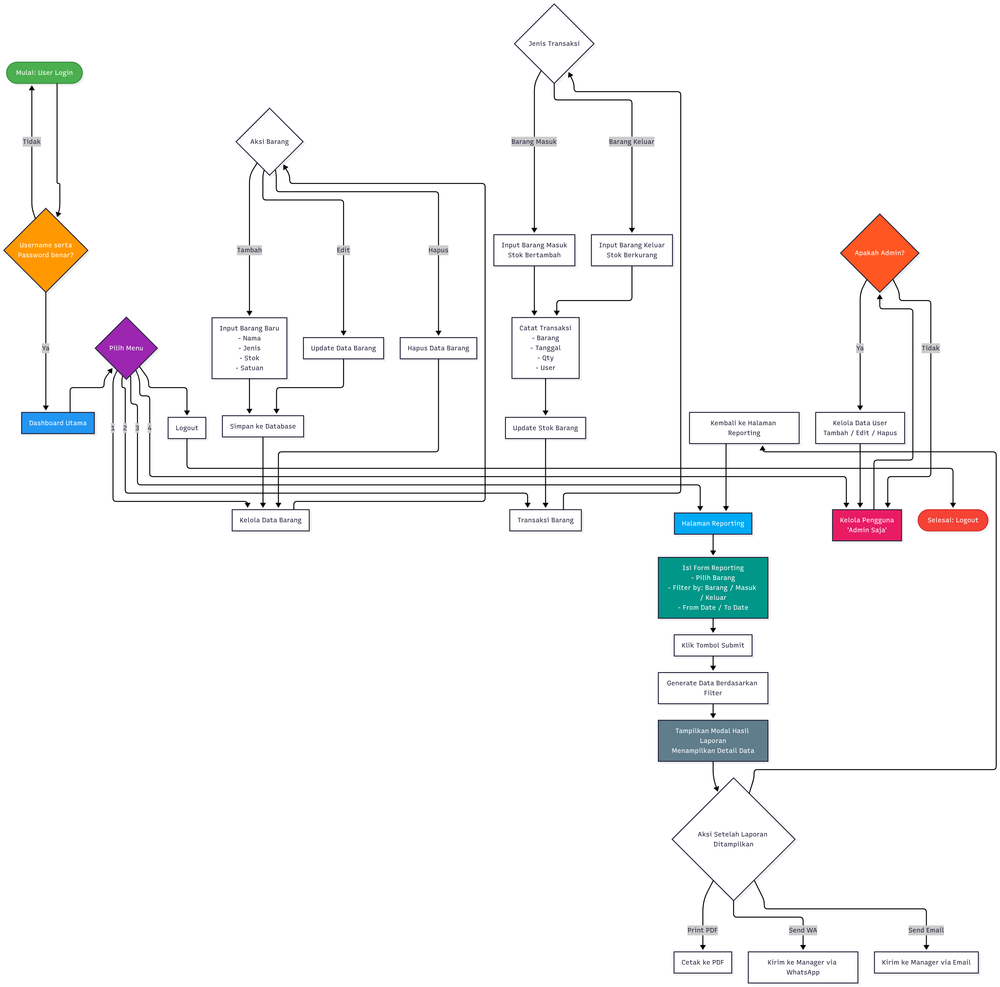
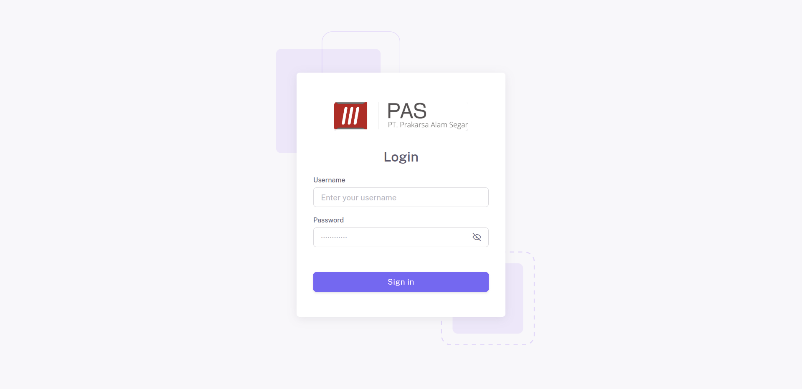
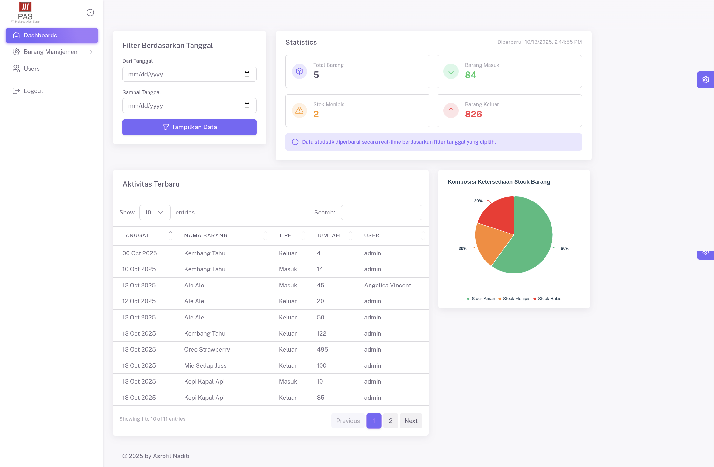
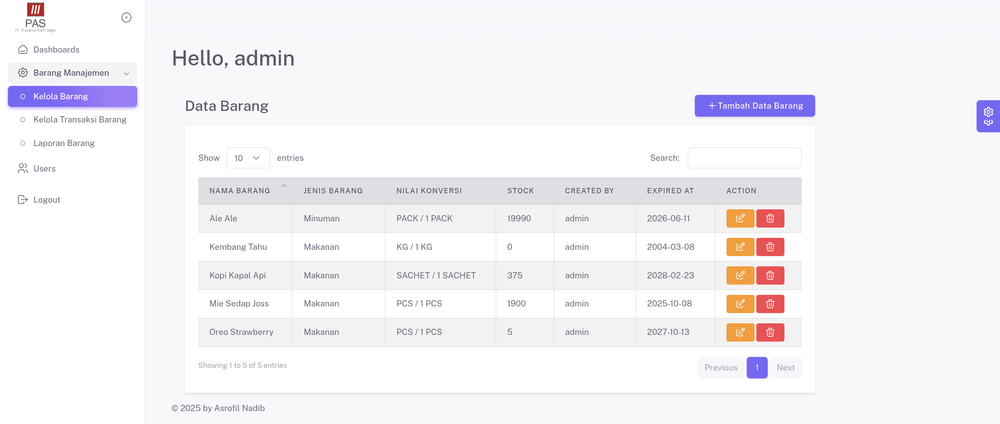
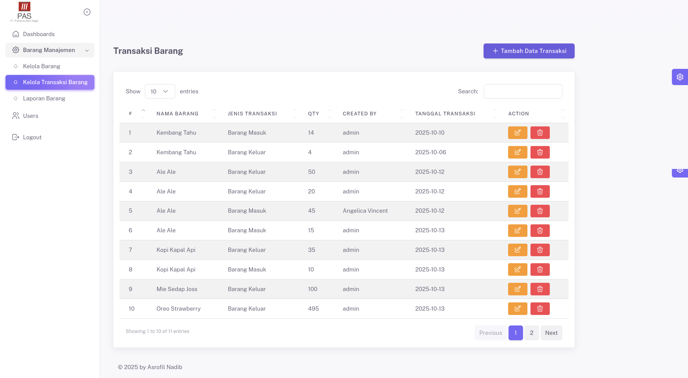
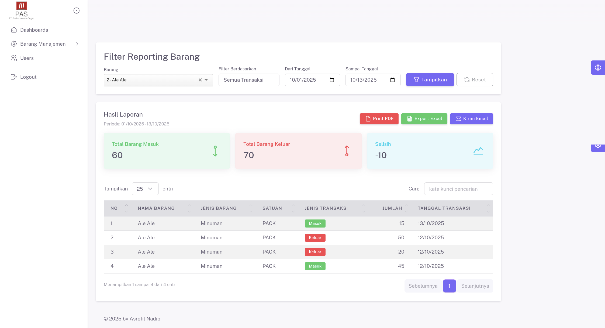

# 📦 Warehouse Management System

Sistem ini merupakan **aplikasi manajemen gudang (Warehouse Management System)** berbasis web yang digunakan untuk memantau dan mengelola barang masuk dan keluar secara efisien.  
Aplikasi ini membantu pengguna untuk melakukan pencatatan transaksi, memantau stok barang, dan menghasilkan laporan berbasis grafik dan tabel secara real-time.

---

## 🚀 Teknologi yang Digunakan

| Stack | Keterangan |
|-------|-------------|
| **Laravel 7** | Framework utama backend berbasis PHP |
| **MySQL** | Database untuk penyimpanan data barang, transaksi, dan user |
| **jQuery** | Library JavaScript untuk manipulasi DOM dan AJAX |
| **DataTables** | Plugin untuk menampilkan tabel data dengan fitur pencarian, sort, dan pagination |
| **SweetAlert** | Plugin untuk menampilkan notifikasi interaktif (alert & konfirmasi aksi) |
| **Bootstrap** | Framework CSS untuk tampilan yang responsif dan modern |
| **Highcharts** | Library grafik untuk menampilkan visualisasi data stok dan transaksi |
| **Selectize.js** | Plugin untuk dropdown input yang lebih interaktif dan mudah digunakan |

---

## 🧩 Fitur Utama

- **Login & Manajemen User** — autentikasi pengguna agar data lebih aman.
- **Manajemen Barang** — tambah, ubah, dan hapus data barang.
- **Transaksi Barang (Masuk & Keluar)** — mencatat pergerakan barang.
- **Dashboard Interaktif** — menampilkan statistik barang, grafik stok, dan aktivitas terkini.
- **Laporan & Export PDF** — laporan transaksi dapat diunduh berdasarkan periode.
- **Notifikasi** — sistem memberi peringatan jika stok menipis atau transaksi gagal diproses.

---

## 🧠 Arsitektur Sistem

### 📘 Entity Relationship Diagram (ERD)



---

### 🔁 Flowchart Sistem



---

## 🖼️ Tampilan Aplikasi

Berikut beberapa tampilan utama dari sistem:

### 🔐 Halaman Login


---

### 📊 Dashboard


---

### 📦 Kelola Barang


---

### 🔄 Transaksi Barang


---

### 📑 Laporan


---

## 📄 Dokumen Tambahan

Dokumen pendukung sistem dapat dilihat pada file berikut:

📘 **[FSD - Warehouse Management System.docx](FSD%20-%20Warehouse%20Management%20System.docx)**

File ini berisi **Functional Specification Document (FSD)** yang menjelaskan alur proses, kebutuhan fungsional, dan detail implementasi sistem.

---

## ⚙️ Cara Menjalankan Aplikasi

1. Clone repository ini:
   ```bash
   git clone https://github.com/username/warehouse-management-system.git
   ```
2. Masuk ke direktori project:
   ```bash
    cd warehouse-management-system
   ```
3. Install dependency composer:
    ```bash
    composer install
    ```
4. Salin file .env.example menjadi .env, lalu sesuaikan konfigurasi database:
    ```bash
    cp .env.example .env
    ```
5. Generate key:
    ```bash
    php artisan key:generate
    ```
6. Jalankan migrasi database:
    ```bash
    php artisan migrate --seed
    ```
7. Jalankan server lokal:
    ```bash
    php artisan serve
    ```
8. Buka di browser:
    ```
    http://127.0.0.1:8000
    ```
